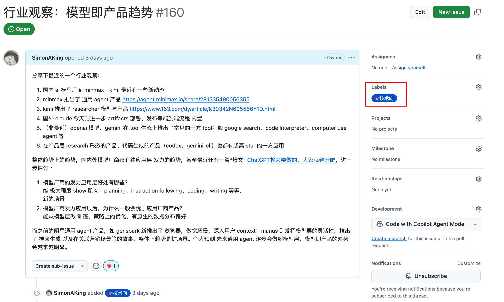
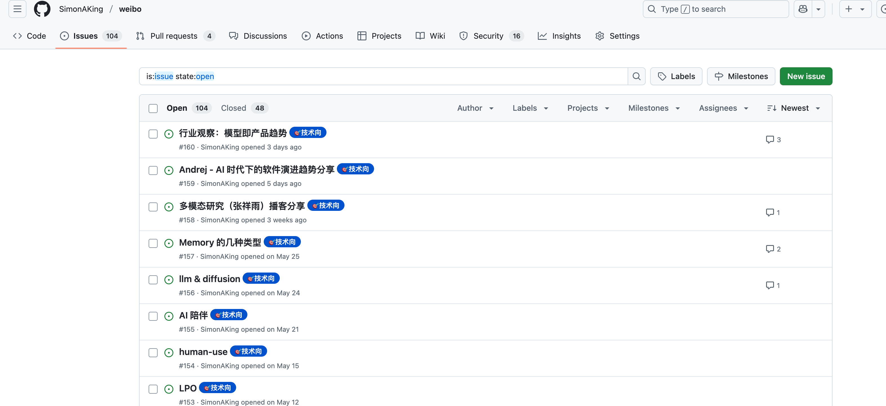
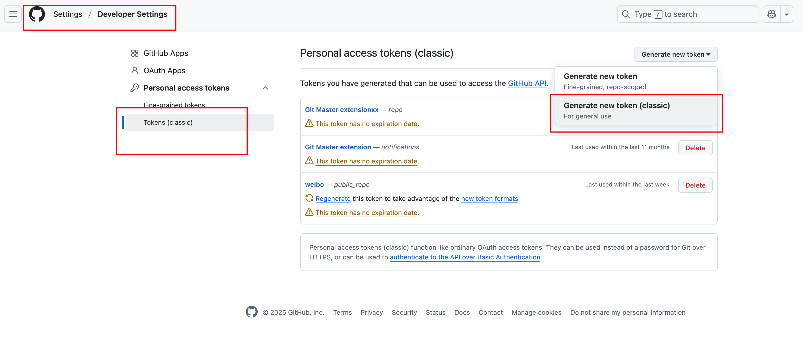
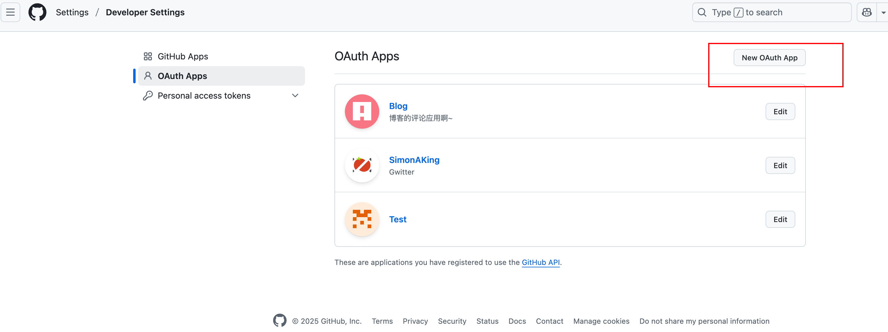

# Gwitter

[中文版本](README.zh_CN.md)

## 🎮 Playground

- **🌐 Live Demo**: [https://simonaking.com/Gwitter](https://simonaking.com/Gwitter) - Experience Gwitter in action
- **💭 Share Your Thoughts**: [Create an Issue](https://github.com/SimonAKing/Gwitter/issues) to join the conversation
- **📚 Browse Discussions**: Explore existing thoughts and insights on the demo site

## ✨ Project Introduction

✨ **The Story Behind "Gwitter"**

Ever wondered what happens when you combine the world's most powerful issue tracker with the globe's favorite microblogging platform? 🤔

**GitHub Issues** 📝 = The unsung hero of note-taking (seriously, it's brilliant!)

**Twitter** 🐦 = Where thoughts become conversations worldwide

**Gwitter** 🚀 = Turn GitHub Issues into your personal microblog platform!


> **📱 Author's Gwitter**: [https://simonaking.com/blog/weibo/](https://simonaking.com/blog/weibo/) - See how Gwitter is used in practice

Gwitter is a lightweight microblogging application built on GitHub Issues. It records my thoughts on technology, life insights, and interesting discoveries. Welcome to join the discussion!

## 🚀 Key Features

1. 📝 GitHub Issues Based
   - Utilizes GitHub Issues as content storage, supporting GitHub's label system for content categorization
2. 👍 Social Interaction
   - Like Feature: Supports GitHub Reactions (👍 ❤️ 😄 😮 😢 😡 🚀 👀)
   - Comment System: Complete commenting functionality with nested replies support
3. ✨ Visual Experience
   - Beautiful Animations: Smooth page animations using Framer Motion
   - Responsive Design: Perfect adaptation for desktop, tablet, and mobile devices
   - Skeleton Screen: Elegant loading state display
4. 🌐 User Experience
   - Internationalization Support: Built-in Chinese and English bilingual support
   - Infinite Scroll: Smart pagination loading for smooth browsing experience
5. 🤖 Automated Synchronization
   - Multi-platform Sync: Automatically sync newly published Issues to other platforms via GitHub Actions

## 📝 Usage Instructions

### Publishing Content

1. Create a new Issue in the configured GitHub repository
2. Write content using Markdown format
3. Add appropriate labels for categorization
4. Content will automatically sync to the gwitter application after publishing


### Content Management

- **Edit**: Edit directly in GitHub Issues
- **Delete**: Close the corresponding Issue
- **Categorize**: Use GitHub Labels for content categorization
- **Pin**: Control display order through Issue creation sequence

### 🤖 Automated Synchronization Configuration

Gwitter supports automatically syncing newly published Issues to Telegram and GitHub Gist via GitHub Actions.

#### Setting up Sync Features

1. **Create Sync Script**
   - Refer to [sync.js](https://github.com/SimonAKing/weibo/blob/master/sync.js) implementation
   - Create `.github/workflows/sync.yml` in the repository

2. **Configure Environment Variables**
   In GitHub repository Settings > Secrets and variables

3. **Telegram Configuration**
   - Create Telegram Bot (via @BotFather)
   - Get Bot Token and target channel/group Chat ID
   - Add Bot to target channel and grant admin permissions

## 🛠️ Tech Stack

- **Frontend Framework**: React 18 + TypeScript
- **Build Tool**: Rsbuild (Fast build tool based on Rspack)
- **Styling Solution**: Emotion (CSS-in-JS)
- **Animation Library**: Framer Motion + React Flip Move
- **State Management**: React Hooks
- **Network Requests**: Axios + GitHub GraphQL API
- **Internationalization**: i18next
- **Code Standards**: ESLint + Prettier

## 📦 Quick Start

### Requirements

- Node.js >= 16
- pnpm >= 8 (recommended)

### 1. Clone the Project

```bash
git clone https://github.com/SimonAKing/Gwitter.git
cd Gwitter
```

### 2. Install Dependencies

```bash
pnpm install
```

### 3. Configure GitHub

#### 3.1 Create GitHub Repository

1. Create a new repository on GitHub to store your microblog content
2. Record the repository's `owner` (username) and `repo` (repository name)
> Similar to https://github.com/SimonAKing/weibo/issues


#### 3.2 Apply for GitHub Personal Access Token

1. Visit [GitHub Settings > Developer settings > Personal access tokens](https://github.com/settings/tokens)
2. Click "Generate new token (classic)"


3. Select the following permissions:
   - `repo` (Full repository access)
   - `read:user` (Read user information)
4. Generate and save the token


#### 3.3 Create GitHub OAuth Application

1. Visit [GitHub Settings > Developer settings > OAuth Apps](https://github.com/settings/developers)
2. Click "New OAuth App"


3. Fill in development and production environment application information:
   - **Application name**: Gwitter
   - **Homepage URL**: `http://localhost:3000` (development) or your deployment domain
   - **Authorization callback URL**: `http://localhost:3000` (development) or your deployment domain
4. After creation, obtain `Client ID` and `Client Secret`

#### 3.4 Configure Application

Modify the `src/config/index.ts` file:

```typescript
const config = {
  request: {
    // GitHub Personal Access Token
    token: ['your_token_part1', 'your_token_part2'],

    // OAuth configuration
    clientID: isDev ? 'dev_client_id' : 'prod_client_id',
    clientSecret: isDev ? 'dev_client_secret' : 'prod_client_secret',

    // GitHub repository configuration
    owner: 'your_github_username',
    repo: 'your_repo_name',

    // Pagination configuration
    pageSize: 6,

    // CORS proxy (optional)
    autoProxy: 'https://cors-anywhere.azm.workers.dev/https://github.com/login/oauth/access_token',
  },

  app: {
    // Application feature toggles
    onlyShowOwner: false,
    enableRepoSwitcher: false,
    enableAbout: false,
    enableEgg: false,
  },
};
```

## ⚙️ Configuration Options

### Request Configuration (`config.request`)

| Option | Type | Description | Usage Scenario |
|--------|------|-------------|----------------|
| `token` | `string[]` | GitHub Personal Access Token split into two parts | **Security**: Split token to avoid exposure in source code. Combine both parts to form complete token |
| `clientID` | `string` | GitHub OAuth Application Client ID | **Authentication**: Different IDs for development/production environments |
| `clientSecret` | `string` | GitHub OAuth Application Client Secret | **Authentication**: Different secrets for development/production environments |
| `owner` | `string` | GitHub repository owner (username) | **Data Source**: Specify which user's repository to use for content |
| `repo` | `string` | GitHub repository name | **Data Source**: Specify which repository contains the Issues/content |
| `pageSize` | `number` | Number of issues to load per page | **Performance**: Control loading speed and memory usage. Recommended: 6-12 |
| `autoProxy` | `string` | CORS proxy URL for OAuth requests | **CORS**: Required for client-side OAuth flow. Use when deploying to static hosting |

### Application Configuration (`config.app`)

| Option | Type | Description | Usage Scenario |
|--------|------|-------------|----------------|
| `onlyShowOwner` | `boolean` | Show only repository owner's issues | **Privacy**: Set to `true` for personal blogs, `false` for community discussions |
| `enableRepoSwitcher` | `boolean` | Enable repository switching functionality | **Multi-repo**: Set to `true` when managing multiple content repositories |
| `enableAbout` | `boolean` | Show About page/section | **Information**: Display author information and project details |
| `enableEgg` | `boolean` | Enable easter egg features | **Fun**: Hidden features or interactive elements for user engagement |

### Dynamic Configuration Override

You can override any configuration at runtime by defining `window.GWITTER_CONFIG`:

```html
<script>
  window.GWITTER_CONFIG = {
    app: {
      enableAbout: true,
      enableEgg: true,
    },
    request: {
      pageSize: 10,
    }
  };
</script>
```

### Common Configuration Scenarios

1. **Personal Blog Setup**
   ```typescript
   app: {
     onlyShowOwner: true,    // Show only your content
     enableAbout: true,      // Display your information
     enableRepoSwitcher: false, // Single repository
   }
   ```

2. **Community Discussion Platform**
   ```typescript
   app: {
     onlyShowOwner: false,   // Show all participants
     enableRepoSwitcher: true, // Multiple topic repositories
     enableAbout: false,     // Focus on content
   }
   ```

3. **Development Environment**
   ```typescript
   request: {
     pageSize: 3,           // Smaller pages for testing
     // Use development OAuth credentials
   }
   ```

### Build Configuration (`rsbuild.config.mjs`)

| Option | Type | Description | Usage Scenario |
|--------|------|-------------|----------------|
| `output.assetPrefix` | `string` | Static asset prefix path | **Deployment**: Set CDN URL or subdirectory path. Examples: `'https://cdn.example.com/'`, `'/Gwitter/'` |

**Example Configuration:**
```javascript
export default defineConfig({
  output: {
    assetPrefix: process.env.NODE_ENV === 'production'
      ? 'https://your-domain.com/Gwitter/'
      : '/',
  },
});
```

### 4. Start Development Server

```bash
pnpm dev
```

Visit [http://localhost:3000](http://localhost:3000) to view the application.

### 5. Configure Asset Prefix (Optional)

For deployment to subdirectories or CDN, modify `rsbuild.config.mjs`:

```javascript
export default defineConfig({
  // ... other configurations
  output: {
    assetPrefix: 'https://your-domain.com/Gwitter/', // or '/Gwitter/' for relative path
  },
});
```

### 6. Build and Deploy

```bash
# Build for production
pnpm build

# Preview the build result
pnpm preview
```

## 🎨 Customization

### Modify Theme

Edit `src/components/common/IssueLayout.tsx` and related style files to customize the interface style.

### Add Features

The project uses modular design for easy feature addition:

- `src/components/`: UI components
- `src/hooks/`: Custom Hooks
- `src/utils/`: Utility functions
- `src/config/`: Configuration files

### Internationalization

Add new language files in the `src/i18n/locales/` directory and register them in `src/i18n/index.ts`.

## 🤝 Contributing

Issues and Pull Requests are welcome!

---

<div align="center">

**Thank you for your attention and support!**

If you like this project, don't forget to give it a ⭐!

Made with ❤️ by [SimonAKing](https://github.com/SimonAKing)

</div>