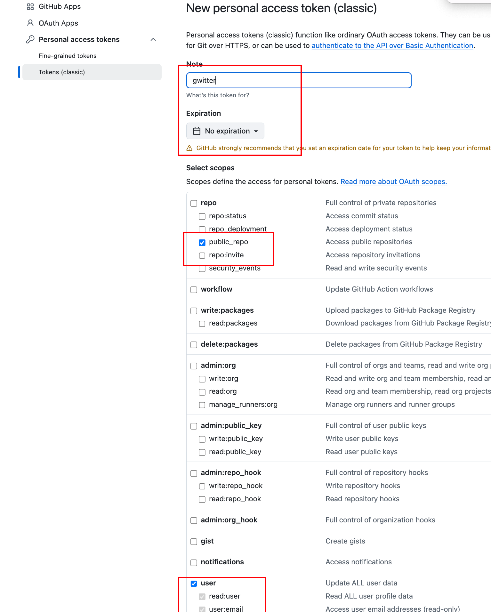
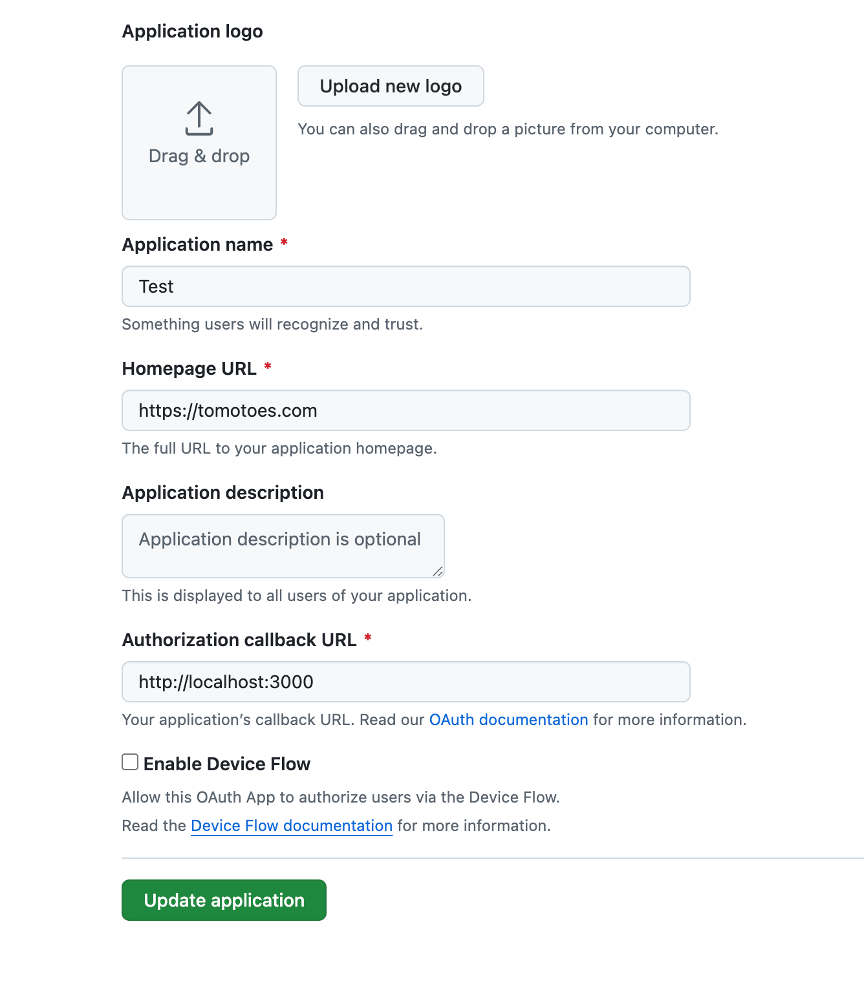
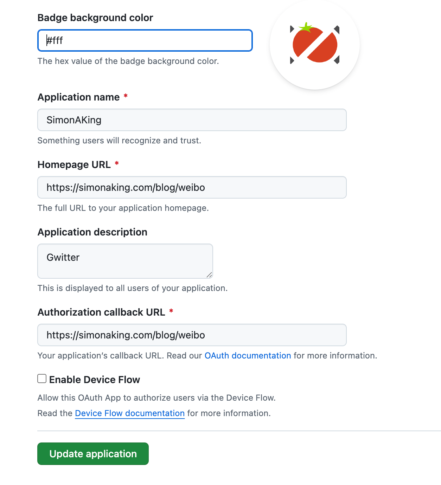

# Gwitter

[English Version](README.md)

## 🎮 在线体验

- **🌐 在线演示**: [https://simonaking.com/gwitter](https://simonaking.com/gwitter) - 体验 Gwitter 的完整功能
- **💭 分享想法**: [创建 Issue](https://github.com/SimonAKing/Gwitter/issues) 参与讨论交流
- **📚 浏览讨论**: 在演示站点上探索现有的思考和见解

## ✨ 项目介绍

> **项目名称的由来** 💡
> GitHub Issues（几乎）是最好的笔记应用 📝
> Twitter 是世界上最大的微博平台 🐦
> 那么 Gwitter 就是来源于此！


Gwitter 是一个基于 GitHub Issues 构建的轻量级微博应用。这里记录着我对技术的思考、对生活的感悟，以及一些有趣的发现，欢迎一起交流探讨。

## 🚀 亮点功能

1. 📝 基于 GitHub Issues
  利用 GitHub Issues 作为内容存储，支持 GitHub 的标签系统进行内容分类

2. 👍 社交互动
  - **点赞功能**：支持 GitHub Reactions（👍 ❤️ 😄 😮 😢 😡 🚀 👀）
  - **评论系统**：完整的评论功能，支持嵌套回复

3. ✨ 视觉体验
  - **精美动效**：使用 Framer Motion 实现流畅的页面动画
  - **响应式设计**：完美适配桌面端、平板和移动设备
  - **骨架屏**：优雅的加载状态展示

4. 🌐 用户体验
  - **国际化支持**：内置中英文双语支持
  - **无限滚动**：智能分页加载，流畅浏览体验

5. 🤖 自动化同步
  - **多平台同步**：通过 GitHub Actions 自动将新发布的 Issue 同步到其他平台

## 🛠️ 技术栈

- **前端框架**：React 18 + TypeScript
- **构建工具**：Rsbuild（基于 Rspack 的快速构建工具）
- **样式方案**：Emotion (CSS-in-JS)
- **动画库**：Framer Motion + React Flip Move
- **状态管理**：React Hooks
- **网络请求**：Axios + GitHub GraphQL API
- **国际化**：i18next
- **代码规范**：ESLint + Prettier

## 📦 快速开始

### 环境要求

- Node.js >= 16
- pnpm >= 8 (推荐)

### 1. 克隆项目

```bash
git clone https://github.com/SimonAKing/Gwitter.git
cd Gwitter
```

### 2. 安装依赖

```bash
pnpm install
```

### 3. 配置 GitHub

#### 3.1 创建 GitHub Repository

1. 在 GitHub 上创建一个新的仓库用于存储你的微博内容
2. 记录仓库的 `owner`（用户名）和 `repo`（仓库名）
> 类似于 https://github.com/SimonAKing/weibo/issues


#### 3.2 申请 GitHub Personal Access Token

1. 访问 [GitHub Settings > Developer settings > Personal access tokens](https://github.com/settings/tokens)
2. 点击 "Generate new token (classic)"


3. 选择以下权限：
   - `repo` (完整仓库访问权限)
   - `read:user` (读取用户信息)
4. 生成并保存 token


#### 3.3 创建 GitHub OAuth 应用

1. 访问 [GitHub Settings > Developer settings > OAuth Apps](https://github.com/settings/developers)
2. 点击 "New OAuth App"


3. 填写调试以及生产环境的应用信息：
   - **Application name**: Gwitter
   - **Homepage URL**: `http://localhost:3000` (开发环境) 或你的部署域名
   - **Authorization callback URL**: `http://localhost:3000` (开发环境) 或你的部署域名
4. 创建后获得 `Client ID` 和 `Client Secret`



#### 3.4 配置应用

修改 `src/config/index.ts` 文件：

```typescript
const config = {
  // GitHub Personal Access Token
  token: ['your_token_part1', 'your_token_part2'],

  // GitHub 仓库配置
  owner: 'your_github_username',
  repo: 'your_repo_name',

  // 分页配置
  pageSize: 6,
  offsetTop: 1,

  // 用户头像
  avatar: 'https://github.com/your_username.png',

  // OAuth 配置
  clientID: isDev ? 'dev_client_id' : 'prod_client_id',
  clientSecret: isDev ? 'dev_client_secret' : 'prod_client_secret',

  // CORS 代理 (可选)
  autoProxy: 'https://cors-anywhere.azm.workers.dev/https://github.com/login/oauth/access_token',
};
```

### 4. 启动开发服务器

```bash
pnpm dev
```

访问 [http://localhost:3000](http://localhost:3000) 查看应用。

### 5. 构建部署

```bash
# 构建生产版本
pnpm build

# 预览构建结果
pnpm preview
```

## 📝 使用说明

### 发布内容

1. 在配置的 GitHub 仓库中创建新的 Issue
2. 使用 Markdown 格式编写内容
3. 添加合适的标签进行分类
4. 发布后内容会自动同步到微博应用


### 内容管理

- **编辑**：直接在 GitHub Issues 中编辑
- **删除**：关闭对应的 Issue
- **分类**：使用 GitHub Labels 进行内容分类
- **置顶**：通过 Issue 的创建顺序控制显示顺序

### 🤖 自动化同步配置

Gwitter 支持通过 GitHub Actions 自动将新发布的 Issue 同步到 Telegram 和 GitHub Gist。

#### 设置同步功能

1. **创建同步脚本**
   - 参考 [sync.js](https://github.com/SimonAKing/weibo/blob/master/sync.js) 实现
   - 在仓库中创建 `.github/workflows/sync.yml`

2. **配置环境变量**
   在 GitHub 仓库的 Settings > Secrets and variables

3. **Telegram 配置**
   - 创建 Telegram Bot（通过 @BotFather）
   - 获取 Bot Token 和目标频道/群组的 Chat ID
   - 将 Bot 添加到目标频道并授予管理员权限

## 🎨 定制化

### 修改主题

编辑 `src/components/common/IssueLayout.tsx` 和相关样式文件来定制界面风格。

### 添加功能

项目采用模块化设计，可以轻松添加新功能：

- `src/components/`: 界面组件
- `src/hooks/`: 自定义 Hooks
- `src/utils/`: 工具函数
- `src/config/`: 配置文件

### 国际化

在 `src/i18n/locales/` 目录下添加新的语言文件，并在 `src/i18n/index.ts` 中注册。

## 🤝 贡献

欢迎提交 Issue 和 Pull Request！

---

<div align="center">

**感谢你的关注与支持！**

如果你喜欢这个项目，别忘了点个 ⭐ 哦~

Made with ❤️ by [SimonAKing](https://github.com/SimonAKing)

</div>
